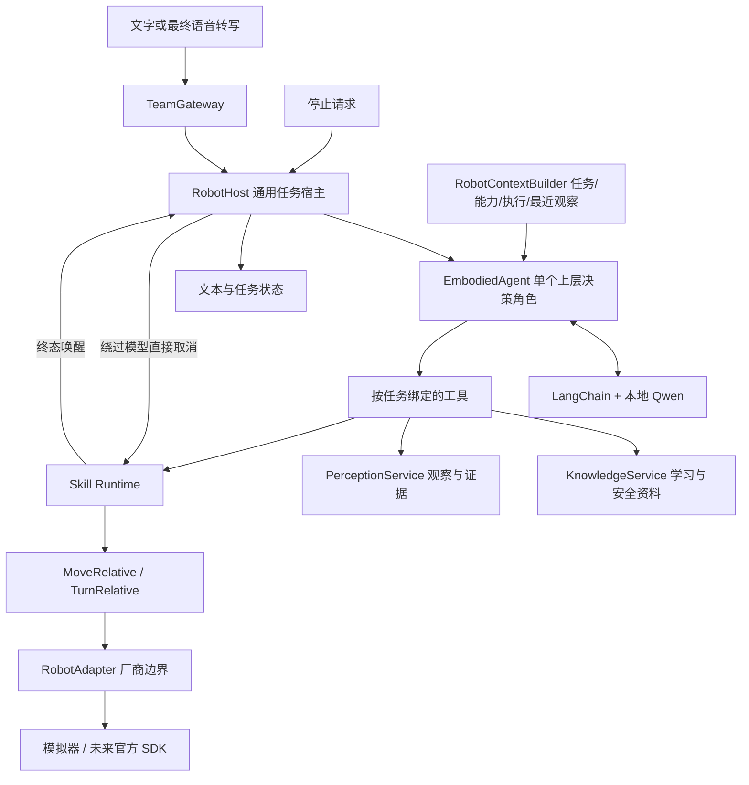

# 家庭学习陪伴与安全教育机器人框架

## 赛题目标与实现边界

主应用支持家庭场景中的观察、陪伴问答、安全知识查询和机器人运动。固定课程是显式选择的扩展模式，不是机器人启动、动作执行或知识查询的前提。

| 赛题能力 | 框架入口 | 当前实现 |
| --- | --- | --- |
| 陪伴交互 | RobotApplication → RobotHost → EmbodiedAgent | 真实本地模型与文字控制台；每条输入独立任务 |
| 物体识别 | observe_scene → PerceptionService → VisionProvider | 主入口模拟感知；本地 VLM 已独立联调，真实相机待接入 |
| 移动讲解 | submit_action → Runtime → Skill → RobotAdapter | 模拟相对移动、转向及终态反馈；真实设备和导航待接入 |
| 安全教育 | lookup_knowledge → KnowledgeService | 热水、插座开发示例，明确来源与待审核状态；不是风险检测或安全认证 |
| 语音交互 | ASRProvider → submit_transcript；输出可接 TTSProvider/AudioPlayer | 保留协议与最终转写去重；真实录音、识别、播放尚未装配 |
| 可选系统教学 | ClassroomHost → TeachingFlow → EducationService | 规则出题、评价与学习进度；独立演示入口 |

## 主链路

决策器按任务绑定，宿主串行处理任务；不是多个协商 Agent。任务不绑定课堂、学生成绩或固定几何课程。教学和动作状态分别管理。

## 任务规则

1. 应用启动时显式连接 RobotAdapter，装配与设备能力相符的 SkillRegistry。
2. 创建通用任务并注册到 RobotHost；不要调用 EducationService.start_session。
3. 文字或最终语音经 TeamGateway 进入统一队列，唯一消费者调用 process_next。
4. 每轮模型读取任务目标、设备能力、可用动作、执行记录及最近观察。没有课程时不暴露 get_teaching_state 或 evaluate_answer。
5. 模型可查询知识、观察或提交一个动作。观察保留证据及采集时间；运动提交使旧观察失效。后续需要现场信息时重新调用 observe_scene。
6. 动作提交返回编号，宿主通过 wait_for_action 等待真实终态；失败结束任务，成功后若已有场景观察，运动终态先使场景版本失效，宿主再以两秒新鲜度要求重新观察，再交给模型续接；不依赖模型口头承诺调用观察工具。每条请求最多三个动作，达到上限会停止任务，不声称总体目标完成。
7. 返回最终文本且实际动作均结束后，由宿主显式结束本次交互。completed 表示本次请求处理结束，不代表模型文字已经被外部事实验证。
8. 停止直接取消模型等待和 Runtime 动作，不经过模型工具选择；设备停止仍需验证。远端 GPU 是否即时停止不作保证。

相同成功输入编号重试返回原结果；编号冲突拒绝。失败输入禁止自动重放，避免重复移动。主控制台忙碌期间拒绝新普通任务，并允许 /stop；不实现多任务并行运动。

## 装配与扩展

- 主入口：`main.py` → `app/robot_console.py` → `RobotApplication`。
- 设备：注入 `RobotAdapter`；未知设备不会隐式回退模拟。接官方设备时替换装配入口中的构造器。
- 感知：注入 `PerceptionService`；由感知实现管理相机、调用 VisionProvider 和证据存储。主控制台当前明确使用 SimulatedPerception，不能以此冒充真实视觉闭环。
- 知识：注入 KnowledgeService；维护带来源条目，不通过创建课程来实现普通查询。
- 课程：显式选择 `app.classroom_demo`。与主控制台不能共享竞争同一个 next_input 的两个消费者；选择一种模式或在更外层明确分发。
- 语音：真实语音服务完成后，将最终转写交给同一 gateway.submit_transcript；播放器的取消与关闭需要与宿主生命周期联调。目前只提供这些接口，不宣称已实现播报。

当前控制台使用 macOS/Linux 的事件循环终端读取；退出释放输入监听、任务、感知与设备。对话以独立请求为单位，尚无跨任务长期陪伴记忆；同一任务内部的动作与观察状态用于续接，不把“它”“刚才那个”自动绑定到上一个已结束任务。

## 验收

- 无 EducationService 的应用可完成安全知识问答并结束零动作任务。
- 观察 → 相对转向 → 等待成功 → 再观察 → 回答，可由受控模型完整驱动；结果明确模拟。
- 移动后的旧观察 stale 为 True；不支持的设备能力在提交前拒绝。
- 停止不等模型完成；设备失败不重试，重复输入不再次运动。
- 固定课堂的已有测试继续通过，作为可选模式保留。

真实摄像头、机器人 SDK、导航、避障和语音需要独立接入验收；VLM 不能凭图片确定液体温度、是否带电或路径可通行性。

## 本次验证记录

2026-10-05：通过真实服务器 Qwen 和新 main.py 控制台验证了热水安全知识查询、观察工具调用、模拟左转、动作终态后的重新观察和结果讲解；/stop 在任务处理中返回 cancelled，退出释放设备。机器人与感知均为模拟，未接真机或实时相机。

首次运动联调暴露出模型缺少技能参数说明，以及口头预告观察但没有实际调用的问题；已将 Skill 参数说明加入上下文，并在宿主层对已有场景的动作强制重新观察。模型也曾颠倒左右转角符号，现已明确方向约定；提示词不保证所有自然语言指令都正确，正式真机前仍需方向及多步指令验收。最终示例明确给出 angle_rad=0.1 后跑通，不据此宣称任意口语指令都可靠。

67 项测试通过，Ruff、格式检查通过，basedpyright 零错误、零警告。测试包括无需课程的安全问答、模拟视觉运动闭环、旧观察失效、宿主主动刷新、失败停止、即时取消、去重及动作上限。模型联调结束后已关闭临时控制台和 SSH 隧道，没有部署常驻服务。
